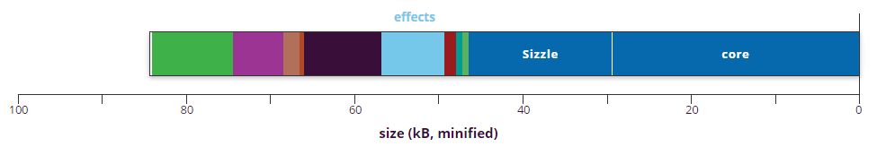
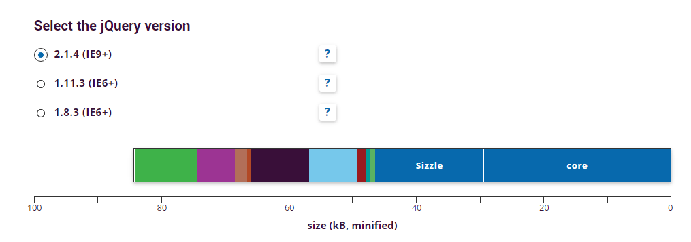

## The site is deprecated. Please use http://jquery.com/download/

# jQueryConfig

**Optimize the size of jQuery for your project.**

Visit: [jqueryconfig.com](http://www.jqueryconfig.com)

## Optimize the Size
By leaving out functionality that you do not need, you can reduce the file size of jQuery. A smaller, custom build will make your website load faster.

On [jqueryconfig.com](http://www.jqueryconfig.com) you can create your own jQuery,
selecting only the modules you need.

## Advantages
Building your own jQuery with jQueryConfig has the following advantages:

1.  makes it easy to build your own, optimal configuration(\*);
2.  offers insight in the effects different modules have on the build size. You can fine-tune the configuration by selecting and deselecting individual modules. The size of the configured build -- in kB, minified -- is shown real-time as a bar graph;
3.  automatically checks for dependencies between modules.
4.  shows information about selection options.

You receive a zipped file containing the uncompressed and minified version of your configuration, with a specification of the included modules.

**Please test your application before using it.**

\*) *Until now it wasn't very easy to build your own jQuery: jQuery offers the option to create such a build, but only on the command line using node, which is not common knowledge among all jQuery users.*

## Three releases of jQuery
The jQueryConfig uses clones of jQuery. To keep it simple, the service of jQueryConfig is restricted to three smartly selected major releases of jQuery:
- the latest stable version
- the latest stable version compatible with IE6, IE7 and IE8
- the latest stable version before the major changes in version 1.9.

If you have special reasons to select different versions, see [jQuery](http://github.com/jquery/jquery) for the alternative build method.

## Tips on how to optimize
### Focus
Focus first on the modules that have biggest impact on the size. Most favorite candidates for savings are the ajax module and the effects module. Even when you need ajax, you might not need a transport module. And even if you do, you probably only need one type of them.

### Trial and Error
Optimize the size by testing. Probably you don't know for sure if a module is needed. Just exclude it and test if your application still works. For example, if a plug-in needs the css module and you excluded it, testing should reveal an error soon: "method `css()` is missing".

### Avoid modules by smart coding
- By making smart coding decisions more modules can be excluded. Depending on your application, the css, offset, dimension and ready modules might not be needed by coding a bit differently. The css module covers the methods `css()`, `show()`, `hide()` and `toggle()`. If you need the `css()` method for *setting* DOM properties, but not for *getting* properties, use a css class and set and remove that class using `addClass()` and `removeClass()`. This will make the whole css module unneccessary! For example, use the class `.hidden{display:none!important}`.
- Like the css module you could probably prevent the use of the offset and dimension modules by setting properties via classes.
- The ready module might be avoidable by placing your scripts at the end of the body. If you don't need the ajax and effects module, the ready module might be the only reason why the deferred module cannot be excluded. So unless the ready module is needed, bigger savings can be gained with little effort.

## Questions and bugs
If you have any questions or problems using [jqueryconfig.com](http://www.jqueryconfig.com)
please create an [issue](https://github.com/mopelabs/jqueryconfig/issues)
here on github. If you have question about jQuery please use the appropriate
channels, like [stackoverflow](http://stackoverflow.com) or [jQuery](http://github.com/jquery/jquery/issues).

## License and disclaimer
The MIT License (MIT)

Copyright © 2015 The jQuery Foundation

Permission is hereby granted, free of charge, to any person obtaining
a copy of this software and associated documentation files (the "Software"),
to deal in the Software without restriction, including without limitation
the rights to use, copy, modify, merge, publish, distribute, sublicense,
and/or sell copies of the Software, and to permit persons to whom the
Software is furnished to do so, subject to the following conditions:

The above copyright notice and this permission notice shall be included
in all copies or substantial portions of the Software.

THE SOFTWARE IS PROVIDED "AS IS", WITHOUT WARRANTY OF ANY KIND,
EXPRESS OR IMPLIED, INCLUDING BUT NOT LIMITED TO THE WARRANTIES
OF MERCHANTABILITY, FITNESS FOR A PARTICULAR PURPOSE AND NONINFRINGEMENT.
IN NO EVENT SHALL THE AUTHORS OR COPYRIGHT HOLDERS BE LIABLE FOR ANY
CLAIM, DAMAGES OR OTHER LIABILITY, WHETHER IN AN ACTION OF CONTRACT,
TORT OR OTHERWISE, ARISING FROM, OUT OF OR IN CONNECTION WITH THE
SOFTWARE OR THE USE OR OTHER DEALINGS IN THE SOFTWARE.
